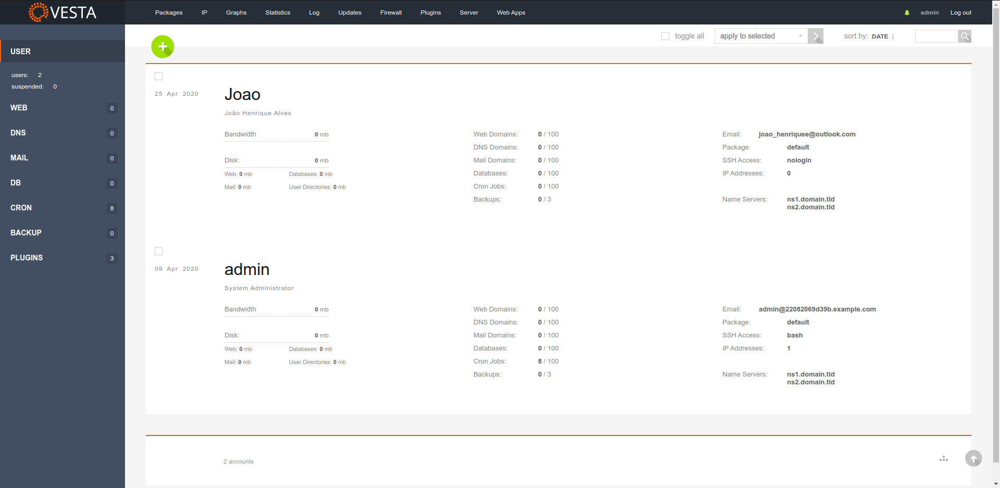

## hestiaCP Theme

## Installation

* Install [hestia Plugins](https://github.com/jhmaverick/hestiacp-plugin-manager) if not already installed.
* In the hestia panel access "Plugins" menu and add the plugin by url `https://github.com/jhmaverick/vestoid-theme`.

